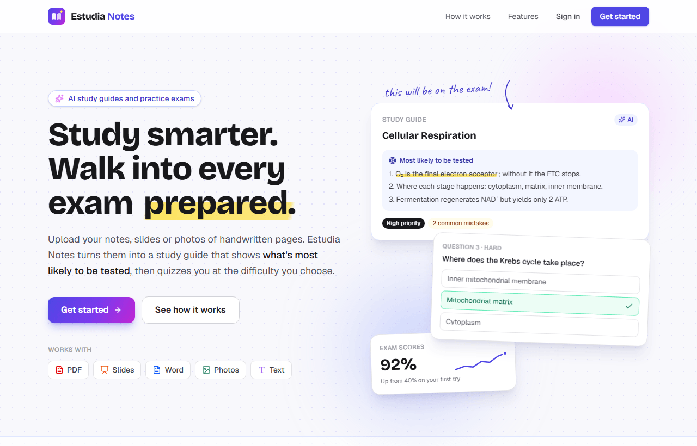
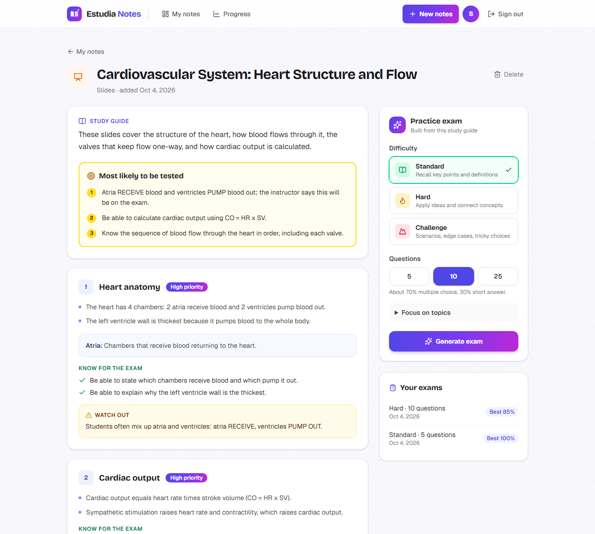
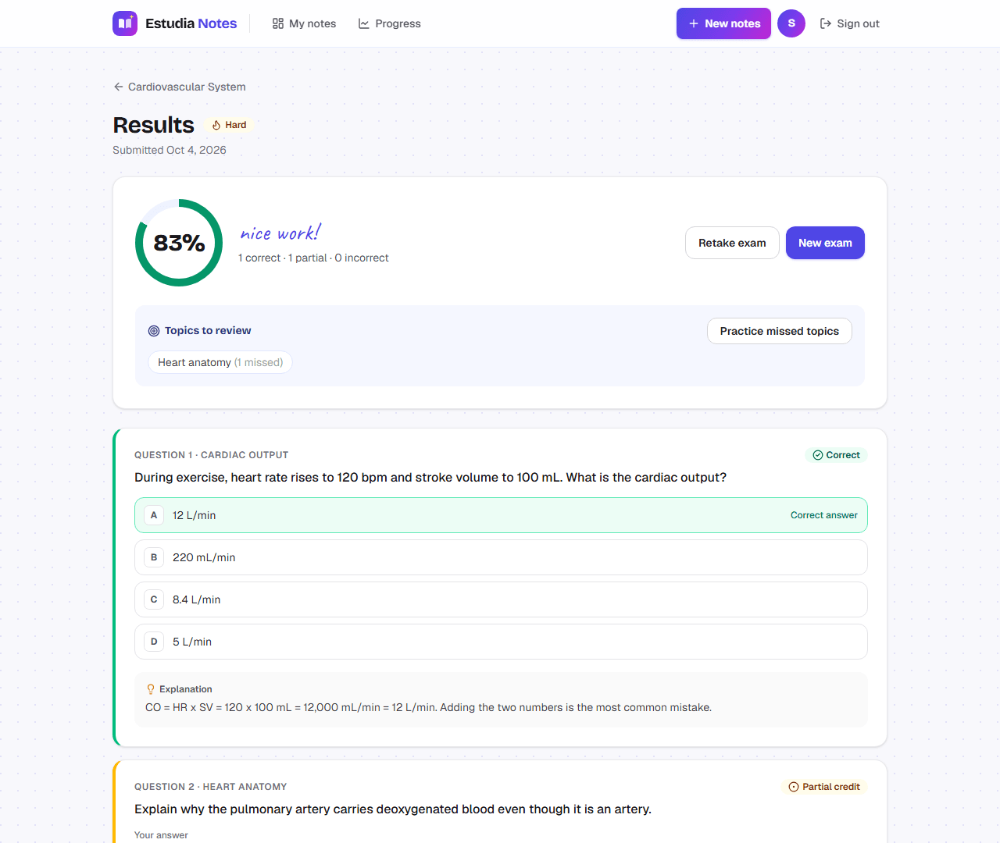
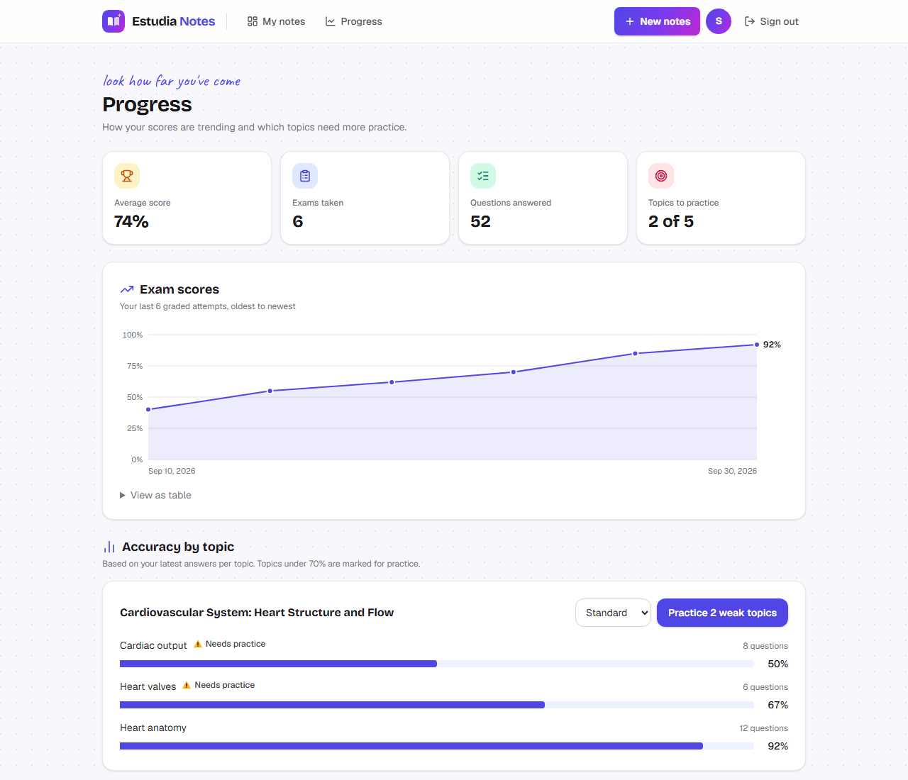
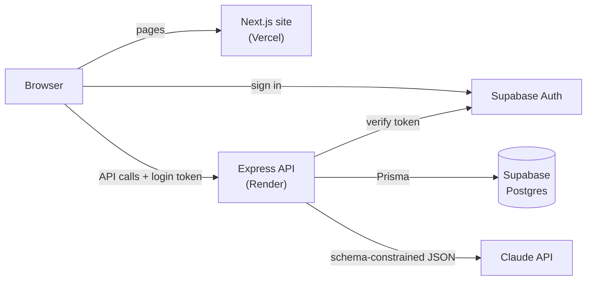

<p align="center">
  
</p>

<h1 align="center">Estudia Notes</h1>

<p align="center">
  <b>Turn your notes into an exam-focused study guide and practice exams, powered by AI.</b><br>
  Upload a PDF, PowerPoint, Word doc, text, or photos of handwritten notes. Get a study guide that shows what's most likely to be tested, then quiz yourself at the difficulty you choose.
</p>

<p align="center">
  <!-- TODO: replace YOUR-APP with your Vercel URL -->
  <a href="https://YOUR-APP.vercel.app"><b>Live demo</b></a> ·
  <a href="docs/HOW-IT-WORKS.md">How it works</a> ·
  <a href="docs/DEPLOYMENT.md">Deployment guide</a>
</p>

<p align="center">
  <a href="https://github.com/bev8090/estudia-notes/actions/workflows/ci.yml"></a>
  
  
  
  
</p>



## Features

- **Upload notes in almost any form**: PDF (including scans), PowerPoint (with speaker notes), Word, text/Markdown, or up to 10 photos of handwritten pages.
- **Exam-focused study guides**: AI explains each topic, ranks what's *most likely to be tested*, marks topic importance, lists "Be able to…" skills, and warns about common mistakes.
- **Practice exams** at Standard, Hard or Challenge difficulty, with 5, 10 or 25 questions (about 70% multiple choice, 30% short answer).
- **Instant grading and feedback**: multiple choice is graded in code; written answers are graded by AI against a rubric with partial credit.
- **Progress tracking**: score history, accuracy per topic, and one-click exams on your weak topics.
- **Private by design**: uploaded files are read once and never stored, and each user can only ever see their own data.

| Study guide | Results | Progress |
|---|---|---|
|  |  |  |

## How it works



The browser never talks to the database or the AI directly. Every request goes through the Express API, which verifies the user's login token and scopes every query to that user. AI work (10–60 seconds) runs as a background job: the API saves a `PROCESSING` row, responds immediately, and the page polls until it's `READY`.

## Tech stack

| Layer | Technology |
|---|---|
| Frontend | Next.js 16 (App Router), React 19, TypeScript, Tailwind CSS 4, TanStack Query |
| Backend | Node.js 24, Express 5, TypeScript, Zod validation |
| Database | PostgreSQL on Supabase, Prisma 7 ORM and migrations, Row Level Security |
| Auth | Supabase Auth (email/password and Google OAuth), JWT verification on every API request |
| AI | Claude API (Sonnet 5.5) with structured outputs, streaming and adaptive thinking |
| Testing | Vitest, Supertest, GitHub Actions CI with a Postgres service container |
| Hosting | Vercel (frontend), Render (API), Supabase (database and auth) |

## Engineering highlights

- **AI output is validated, never trusted.** Every response must match a Zod schema. Generated questions are checked (four distinct choices, a valid answer, a rubric for written answers), malformed ones are dropped, and the exam is retried once.
- **Answer choices are shuffled on the server**, because models tend to put correct answers in predictable positions; explanations are written to reference choices by content, not letter.
- **The answer key never reaches the browser before submission**: the exam endpoint selects from an explicit field allow-list, and a test fails if any answer field leaks.
- **Study guides steer the exams**: high-importance topics get more questions, and the guide's "common mistakes" become the wrong answer choices.
- **Cost-aware AI**: multiple choice is graded in code, written answers are graded in one batched call, every call logs its token cost, and per-user rate limits and daily caps prevent runaway spend. A study guide costs about $0.04.
- **Untrusted input handling**: files are identified by their content (magic bytes), PowerPoint files are unzipped in memory with a zip-bomb size cap, and notes and answers are wrapped in tags so instructions inside them are ignored (prompt-injection defense).
- **Accessible UI**: nothing relies on color alone, keyboard focus is always visible, chart colors are contrast-checked, and animations respect reduced-motion settings.

Read the full write-up, including the reasoning behind each decision, in [docs/HOW-IT-WORKS.md](docs/HOW-IT-WORKS.md).

## Testing

```bash
cd server
npx vitest run        # 29 unit and API tests (Vitest + Supertest)
npm run smoke:ai      # runs the real AI steps on sample notes (costs a few cents)
```

- **Unit tests** cover the pure logic: question validation and shuffling, scoring, progress math, file-type detection and PowerPoint parsing.
- **API tests** send real HTTP requests to the app and a real Postgres database, with login and the AI replaced by stand-ins. They cover the full note → exam → graded attempt flow and verify that one user can't access another user's data.
- **CI** runs on every push: the server job applies all migrations to a fresh Postgres and runs the tests; the client job typechecks, lints and builds.

## Running locally

**Prerequisites:** Node.js 24, a [Supabase](https://supabase.com) project, and a [Claude API key](https://platform.claude.com).

```bash
git clone https://github.com/bev8090/estudia-notes.git
cd estudia-notes

# API
cd server
cp .env.example .env           # fill in the Supabase and Claude values
npm install                    # also generates the Prisma client
npx prisma migrate deploy      # creates the tables
npm run dev                    # http://localhost:5000

# Website (in a second terminal)
cd client
# create .env.local with NEXT_PUBLIC_SUPABASE_URL, NEXT_PUBLIC_SUPABASE_PUBLISHABLE_KEY
# and NEXT_PUBLIC_API_URL=http://localhost:5000
npm install
npm run dev                    # http://localhost:3000
```

To deploy your own copy, follow [docs/DEPLOYMENT.md](docs/DEPLOYMENT.md).

## Project structure

```
client/                Next.js website
  app/(app)/           signed-in pages: dashboard, notes, exams, results, progress
  app/login/           sign in and sign up
  app/privacy, terms/  legal pages
  components/          shared UI, brand, landing page sections
  proxy.ts             refreshes the session and protects signed-in pages
server/                Express API
  src/routes/          HTTP endpoints
  src/services/        background jobs, file handling, PowerPoint reading
  src/services/ai/     all Claude calls: prompts and schemas
  src/domain/          pure logic: question checks, grading, progress stats
  prisma/              database schema and migrations
  test/                unit and API tests
docs/                  how it works, deployment guide, screenshots
```
